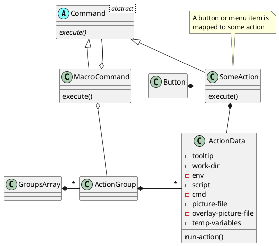

# Session Manager Application

## Introduction

The purpose of this program is that it can quickly setup an environment for something like a programming or music writing task. For example in the case of a programming task;
* start a console with several tabs open to working directories
* start an editor
* start a filemanager with tabs opened to directories you need
* start a reader with some language documentation
  etcetera.

## What is implemented?
* [x] When started, the program is able to show a list of shortcut buttons to start tasks right away. For example, start the browser or a mail program.
* [x] The program must show a list of sessions next to the list of shortcut buttons.
* [ ] List of shortcut buttons can grow or shrink like a bookmark list.
* [x] When a session button is pressed, it shows additional buttons to start a task needed to setup the session.
* [x] The additional buttons are grouped in action lists.
* [ ] (DONE but need changes) A button can be added to start all actions in an actions group.
* [x] There is only one dispatcher instance running. All other instances started later will communicate with the main running program.
* [x] It is possible to swap configurations when starting another instance.


## Additions for later

Optionally the action can show a checkbutton for each program which can be (de)selected to dis-/en-able the start of a program depending on what is needed at that moment.

DBus will play a part by sending commands to the activated parts. This function can check if apps are started, send commands to change, etcetera.

There is a configuration section to create the configuration file.


### Application workings

#### Startup options
* [x] `--config` option pointing to a root directory of the configuration.
* [x] References to parts can now be made from within the config file.
* [x] Actions and variables can be referred to from the config file.


### Uml diagrams



<!--
Optionally the action can show a checkbutton for each program which can be (de)selected to dis-/enable the start of a program depending on what is needed at that moment. *this is something for later.*

The program must therefore show a dispatcher page showing a shallow tree. The actions are at the leafs of the tree and the parents of those actions function as a grouping for those actions. The difference compared to the application menu is that an action can do more than only start one application or script.

DBus will play a part by sending commands to the activated parts. This function can check if apps are started, send commands to change, etcetera. *this is something for later.*

There is a configuration section to create the configuration file. *this is something for later, first read from configurations made by hand.*
-->

<!--

# add mimetype: ~/.local/share/mime/packages/application-x-dispatcher.xml
# run update-mime-database ~/.local/share/mime
# make a config this program can read: test.dispatcher
# associate '.dispatcher' with this program using properties
# click on the icon and voila the dispatcher starts.

# edit /home/marcel/.config/plasma-workspace/env/path.sh (not when installed)
# use desktop files directly with %u or directly with config filled in


## Application workings

A description follows what this program should show and do.

### Startup options
* Option pointing to an alternative configuration file. The default configuration file is stored at `$XDG_CONFIG ?` or at the config root `~/.config/`.
  * Several other files may exist such as a theme description. This can be defined in the configuration file. When absent, the current desktop theme is used.
  ```
  ~/.config/io.github.martimm.dispatcher/
    Data.d/
      theme.yaml                        Theme description
      dispatch.yaml                     The config to use with dispatch info
    Sheets.d/
      dispatch.yaml                     The questionnaire to describe an action
  ```
  * The configuration files are all in a YAML formatted file.

* Option to start an action directly. This option is repeatable.

### User interface
* Menu bar on top
  * Exit          (Save config)
  * Quit          (No save of config)
  * Help
  * About

  * Configuration
    * Save configuration
    * Select a different configuration file
    * Configure dispatch action

  * Action
    * Create
    * Modify
    * Delete

  * Action Map
    * Create
    * Modify
    * Delete

* A treeview of actions

* A configuration page when action is created or changed


## Build phases

### Start with non-gui application.
* install options
* create config files
* test run to start an action

### Make application sceleton
* hook up options
* test run to start main dispatcher
* test run to start an action from secondary dispatcher

### Show menu
* Add simple menu entries

### Show actions
* Display of actions
* Activation of actions
* Add more menu entries

### Modify actions
* Display of action config
* Add more menu entries

### Application workings

#### Startup options
* [x] Option pointing to a root directory of the configuration.

  * Several other files may exist such as a theme description. This can be defined in the configuration file. When absent, the current desktop theme is used.
  ```
  ~/.config/io.github.martimm.dispatcher/
    Data.d/
      theme.yaml                        Theme description
      dispatch.yaml                     The config to use with dispatch info
    Sheets.d/
      dispatch.yaml                     The questionnaire to describe an action
  ```
  * The configuration files are all in a YAML formatted file.

* Option to start an action directly. This option is repeatable.

#### User interface
* Menu bar on top
  * Exit          (Save config)
  * Quit          (No save of config)
  * Help
  * About

  * Configuration
    * Save configuration
    * Select a different configuration file
    * Configure dispatch action
  * Action
    * Create
    * Modify
    * Delete
  * Action Map
    * Create
    * Modify
    * Delete

* A treeview of actions

* A configuration page when action is created or changed


### Build phases

#### Start with non-gui application.
* [x] install options
* [x] create config files
* [x] test run to start an action

#### Make application sceleton
* [x] hook up options
* [x] test run to start main dispatcher
* [x] test run to start an action from secondary dispatcher

#### Show menu
* [x] Add simple menu entries

#### Show actions
* [x] Display of actions
* [x] Activation of actions
* [ ] Add more menu entries

#### Modify actions
* [ ] Display of action config
* [ ] Add more menu entries
-->
