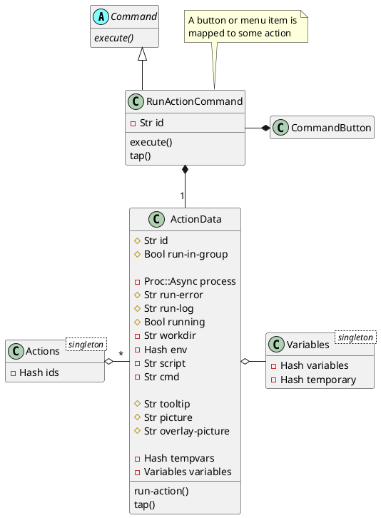
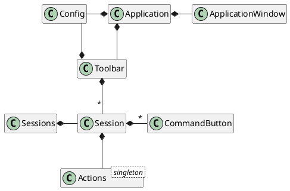
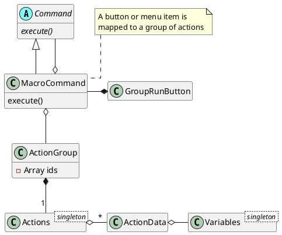
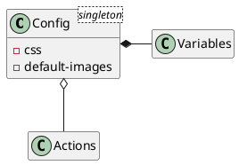
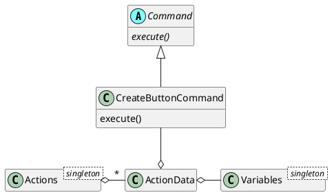

# Session Manager Application

## Introduction

The purpose of this program is that it can quickly setup an environment for something like a programming or music writing task. For example in the case of a programming task;
* start a console with several tabs open to working directories
* start an editor
* start a filemanager with tabs opened to directories you need
* start a reader with some language documentation
  etcetera.

## Checklist?
* [ ] When started, the program is able to show a list of shortcut buttons to start tasks right away. For example, start the browser or a mail program.
* [x] The program shows a list of sessions next to the list of shortcut buttons.
* [ ] List of shortcut buttons can grow or shrink like a bookmark list.
* [x] When a session button is pressed, it shows additional buttons to start a task needed to setup the session.
* [x] The additional buttons are grouped in action lists.
* [ ] A button can be added to start all actions in an actions group.
  * [ ] Optionally each action can show a checkbutton which can be (de-)selected to disable or enable the start of that action.
* [x] There is only one dispatcher instance running. All other instances started later will communicate with the main running program.
* [ ] It is possible to swap configurations when starting another instance.
* [ ] DBus might play a part by sending commands to the activated parts. This function can check if apps are started, send commands to change, etcetera.
* [ ] Editing of actions, variables and sessions. See below.

# Configuration editing

* Variables
  * [x] Storage in <root>/Config/variables.yaml
  * [x] Add variable
  * [ ] Rename variable
    * [ ] With rename change its use in this and other configurations
  * [ ] Modify variable data
  * [ ] Remove variable
    * [ ] Before remove check its use in this and other configurations

* Actions:
  * [x] Storage in <root>/Config/actions.yaml
  * [x] Add action
  * [x] Rename action id
    * [ ] With rename change its use in other configurations
  * [x] Modify action data
  * [ ] Remove action
    * [ ] Before remove check its use in sessions configuration

* Sessions
  * [x] Storage in <root>/Config/sessions.yaml
  * [x] Add session
  * [x] Add session group
  * [ ] Delete session group
  * [x] Add actions to a group
  * [x] Remove actions from a group
  * [x] Rename session
  * [ ] Remove session

### Application workings

  ```plantuml
  @startyaml
  root directory:
    - session-config.yaml
    - Images:
      - Set1 directory
      - Set2 directory
      - ...
    - variables.yaml
    - actions.yaml
    - parts.yaml
    - sessions.yaml
  @endyaml
  ```

#### Startup options
* [x] References to parts can now be made from within the config file.
* [x] Actions and variables can be referred to from the config file.

#### Changes to support editing of actions, variables and sessions
* [ ] Rename `dispatch-config.yaml` to `sessions.yaml`
* [ ] Load all config files as before but save them into separate config files. These files will also be loaded when available after the users config files are loaded. This makes it possible for the user to still change the configuration by hand for the time being.
* Add edit possibilities for;
  * [ ] Variables, saved in `./Config/variables.yaml`
  * [ ] Actions, saved in `./Config/actions.yaml`
  * [ ] Parts, saved in `./Config/parts.yaml`
  * [ ] Sessions, saved in `./Config/sessions.yaml`

# Uml diagrams

Diagram to show action data being used to execute some action after pressing a button.







Diagram to show macro commands which can execute more than one command


The configuration file is the loader of the YAML config file which has references to parts, variables and action data.




<!--
An example to create a command button. Result is a CommandButton



-->

<!--
Optionally the action can show a checkbutton for each program which can be (de)selected to dis-/enable the start of a program depending on what is needed at that moment. *this is something for later.*

The program must therefore show a dispatcher page showing a shallow tree. The actions are at the leafs of the tree and the parents of those actions function as a grouping for those actions. The difference compared to the application menu is that an action can do more than only start one application or script.

DBus will play a part by sending commands to the activated parts. This function can check if apps are started, send commands to change, etcetera. *this is something for later.*

There is a configuration section to create the configuration file. *this is something for later, first read from configurations made by hand.*
-->

<!--

# add mimetype: ~/.local/share/mime/packages/application-x-dispatcher.xml
# run update-mime-database ~/.local/share/mime
# make a config this program can read: test.dispatcher
# associate '.dispatcher' with this program using properties
# click on the icon and voila the dispatcher starts.

# edit /home/marcel/.config/plasma-workspace/env/path.sh (not when installed)
# use desktop files directly with %u or directly with config filled in


## Application workings

A description follows what this program should show and do.

### Startup options
* Option pointing to an alternative configuration file. The default configuration file is stored at `$XDG_CONFIG ?` or at the config root `~/.config/`.
  * Several other files may exist such as a theme description. This can be defined in the configuration file. When absent, the current desktop theme is used.
  ```
  ~/.config/io.github.martimm.dispatcher/
    Data.d/
      theme.yaml                        Theme description
      dispatch.yaml                     The config to use with dispatch info
    Sheets.d/
      dispatch.yaml                     The questionnaire to describe an action
  ```
  * The configuration files are all in a YAML formatted file.

* Option to start an action directly. This option is repeatable.

### User interface
* Menu bar on top
  * Exit          (Save config)
  * Quit          (No save of config)
  * Help
  * About

  * Configuration
    * Save configuration
    * Select a different configuration file
    * Configure dispatch action

  * Action
    * Create
    * Modify
    * Delete

  * Action Map
    * Create
    * Modify
    * Delete

* A treeview of actions

* A configuration page when action is created or changed


## Build phases

### Start with non-gui application.
* install options
* create config files
* test run to start an action

### Make application sceleton
* hook up options
* test run to start main dispatcher
* test run to start an action from secondary dispatcher

### Show menu
* Add simple menu entries

### Show actions
* Display of actions
* Activation of actions
* Add more menu entries

### Modify actions
* Display of action config
* Add more menu entries

### Application workings

#### Startup options
* [x] Option pointing to a root directory of the configuration.

  * Several other files may exist such as a theme description. This can be defined in the configuration file. When absent, the current desktop theme is used.
  ```
  ~/.config/io.github.martimm.dispatcher/
    Data.d/
      theme.yaml                        Theme description
      dispatch.yaml                     The config to use with dispatch info
    Sheets.d/
      dispatch.yaml                     The questionnaire to describe an action
  ```
  * The configuration files are all in a YAML formatted file.

* Option to start an action directly. This option is repeatable.

#### User interface
* Menu bar on top
  * Exit          (Save config)
  * Quit          (No save of config)
  * Help
  * About

  * Configuration
    * Save configuration
    * Select a different configuration file
    * Configure dispatch action
  * Action
    * Create
    * Modify
    * Delete
  * Action Map
    * Create
    * Modify
    * Delete

* A treeview of actions

* A configuration page when action is created or changed


### Build phases

#### Start with non-gui application.
* [x] install options
* [x] create config files
* [x] test run to start an action

#### Make application sceleton
* [x] hook up options
* [x] test run to start main dispatcher
* [x] test run to start an action from secondary dispatcher

#### Show menu
* [x] Add simple menu entries

#### Show actions
* [x] Display of actions
* [x] Activation of actions
* [ ] Add more menu entries

#### Modify actions
* [ ] Display of action config
* [ ] Add more menu entries
-->
